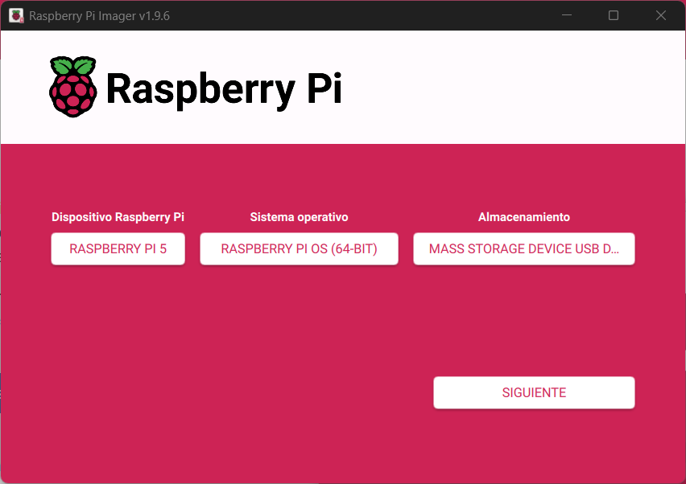

# Configure Raspberry Pi 5  

## Instal Raspberry Pi OS on the SD  

- Install [RaspberryPi Imager](https://www.raspberrypi.com/software/)  
- Execute RaspberryPi Imager  

### General
- Select Raspberry Pi 5  
- Select Raspberry Pi OS (64-BIT)  
- Select SD storage (or SSD if you have an SSD adapter for the PC)  

  

## Instal Raspberry Pi OS on the SSD
- Launch the Raspberry with the SD card.  
- Use the RaspberryPi Imager preinstaled on RaspberryPi OS as described for de SD selecting the SSD.

### Option B: Install manually.
- Download image from [raspberrypi.com](https://www.raspberrypi.com/software/operating-systems/)  
- Unzip the image.
```bash
unxz -v nombre_de_la_imagen.img.xz
```
- Install the image in the SSD.
```bash
sudo dd if=<raspi.img> of=/dev/nvme0n1 bs=4M status=progress conv=fsync
```
- Shutdown the raspberryPi and extract the SD.  
- Power on without the SD card and configure the raspberryPi.  
- Expand the disk if necesary
```bash
lsblk #Check space
sudo raspi-config --expand-rootfs
```

## Configure Raspberry Pi OS  
Default user is set to ```dev```.

### Create users
```bash
sudo su root
sudo passwd #Insert new password for root
sudo adduser dev #Should be the default
su dev
sudo adduser production
sudo adduser extern
cat /etc/passwd #Verify
```

### Configure autologin
- Add to /etc/slightdm/lightdm.conf
```ini
[SeatDefaults]
  autologin-user=production
  autologin-user-timeout=10
```

### Configure SSH
- Add to /etc/ssh/sshd_config
```ini
AllowUsers dev
```

### Menu -> Preferences -> RaspberryPi Configuration
- Interfaces:
  - Enable SSH
  - Enable VNC

### Configure network
- Configure WIFI via GUI
- Configure IP:
  ```bash
  nmcli con show  # Show network adapters
  sudo nmcli con mod <CON_NAME> ipv4.addresses "<NEW_IP1>/24,<NEW_IP2>/24,..."
  #sudo nmcli con mod <CON_NAME> ipv4.gateway "192.168.1.1"
  #sudo nmcli con mod <CON_NAME> ipv4.dns "8.8.8.8,8.8.4.4"
  sudo nmcli con mod <CON_NAME> ipv4.method manual
  #sudo nmcli con mod <CON_NAME> ipv4.method dhcp
  sudo nmcli con down <CON_NAME>
  sudo nmcli con up <CON_NAME>
  ```


### Update packages
```bash
sudo rpi-update
sudo rpi-eeprom-update -a
sudo apt update
sudo apt upgrade
```

### Uninstall default programs
```bash
sudo apt remove --purge geany
sudo apt remove --purge thonny
#sudo apt autoremove
```

### Createfolder structure  
#### Structure
```
/
|--- bin
|--- ...
|--- home
|    |--- dev
|    |    |--- Projects
|    |    `--- ...
|    `--- ...
|--- ...
|--- mnt
|    |--- shared
|    |    |--- images
|    |    |--- models
|    |    |--- datasets
|    |    `--- ...
|    `--- ...
`--- ...
```
#### Shared folder  
```bash
mkdir /mnt/shared
sudo chmod 777 /mnt/shared/
sudo setfacl -R -d -m u::rwx,g::rwx,o::rwx /mnt/shared
mkdir /mnt/shared/images
mkdir /mnt/shared/models
```
#### Project
```bash
mkdir ~/Projects
cd ~/Projects
```

### Share folders
#### Configure samba
- Install
```bash
sudo apt update
sudo apt install samba
sudo smbpasswd -a extern
```
> **`/etc/samba/smb.conf`**
> ```ini
> # [homes]
> #    comment = Home Directories
> #    browsable = no
> ...
> [shared]
>    path = /mnt/shared
>    browseable = yes
>    writable = yes
>    guest ok = no
>    valid users = extern
>    create mask = 0777
>    directory mask = 0777
>    force user = extern  # Optional: For files created as user extern
> ```
- Restart samba.
```bash
sudo systemctl restart smbd
```
- On Windows.
  - Add new ubicacion de red.  
  - Network direction or Internet: \\\\\<RaspberryPi IP>\shared  
  - Set a name to show on the File Explorer.  
  - Use samba user and password.  

## Configure Git
```bash
git config --global user.name "<User Name>"
git config --global user.email "<User e-mail>"
git config --global core.editor "code"
```

## Install VSCode
```bash
sudo apt install code
```

## Install Python latest version
```bash
sudo apt-get install -y build-essential tk-dev libncurses5-dev libncursesw5-dev libreadline6-dev libdb5.3-dev libgdbm-dev libsqlite3-dev libssl-dev libbz2-dev libexpat1-dev liblzma-dev zlib1g-dev libffi-dev
cd ~/Downloads
wget https://www.python.org/ftp/python/<VERSION>/Python-<VERSION>.tgz #Or download file from python.org
sudo tar xf Python-<VERSION>.tgz
cd Python-<VERSION>
sudo ./configure --enable-optimizations
sudo make -j <cores -> lscpu>
sudo make altinstall
```

## [Instal Docker Engine](https://docs.docker.com/engine/install/debian/#install-using-the-repository)
- Uninstall old versions
```bash
for pkg in docker.io docker-doc docker-compose podman-docker containerd runc; do sudo apt-get remove $pkg; done
```
- Setup Docker's ```apt``` repository
```bash
# Add Docker's official GPG key:
sudo apt-get update
sudo apt-get install ca-certificates curl
sudo install -m 0755 -d /etc/apt/keyrings
sudo curl -fsSL https://download.docker.com/linux/debian/gpg -o /etc/apt/keyrings/docker.asc
sudo chmod a+r /etc/apt/keyrings/docker.asc

# Add the repository to Apt sources:
echo \
  "deb [arch=$(dpkg --print-architecture) signed-by=/etc/apt/keyrings/docker.asc] https://download.docker.com/linux/debian \
  $(. /etc/os-release && echo "$VERSION_CODENAME") stable" | \
  sudo tee /etc/apt/sources.list.d/docker.list > /dev/null
sudo apt-get update
```

- Install the Docker packages
```bash
sudo apt-get install docker-ce docker-ce-cli containerd.io docker-buildx-plugin docker-compose-plugin
```

- Verify installation
```bash
sudo docker run hello-world
```

# Usage
## SSH access
```powershell
ssh <user>@<device_ip_address>
```
To exit use ctr+d.  
